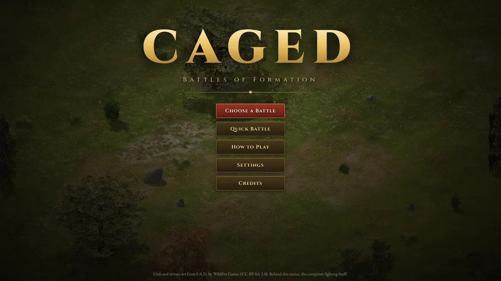
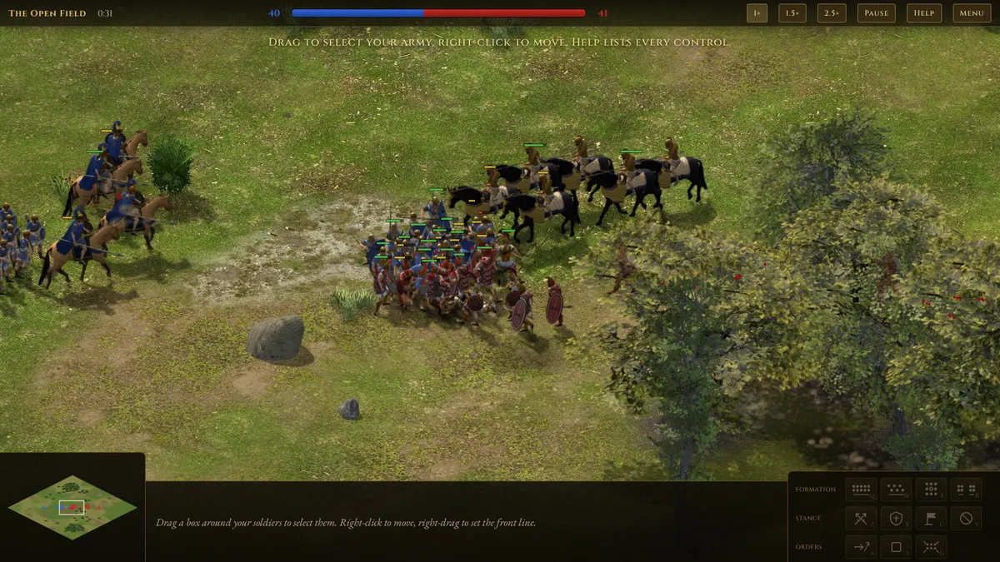
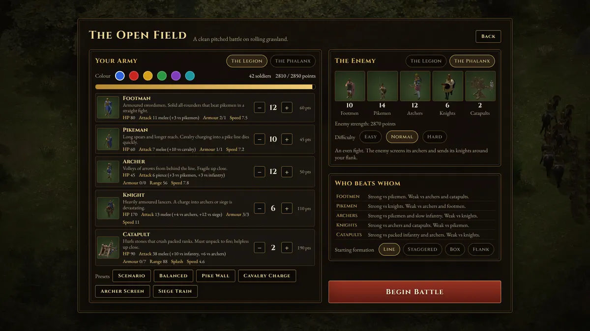

# Caged: Battles of Formation

A browser real-time tactics game in the spirit of Age of Empires II. You get an
army of knights, footmen, pikemen, archers and catapults, set it up the way you
like, and fight a computer opponent. Units march and fight in AoE2-style
formations, and every unit type has bonus damage against the types it counters.





## Features

- **Formations modelled on AoE2.** An army is sorted into sub-formations, front
  to back: cavalry, melee infantry, archers, siege. Footmen and pikemen
  alternate along the line. Line, staggered, box and flank shapes, a marching
  column for long moves, slowest-unit speed, and synchronized re-forming so
  nobody walks backwards or crosses paths. [docs/FORMATIONS.md](docs/FORMATIONS.md)
  covers the research and the design.
- **Counters and bonus damage.** AoE2's damage formula, with melee and pierce
  armour and bonus damage by armour class: pikes against cavalry, knights
  against archers and siege, footmen against pikes. Cavalry charges, flank and
  rear attacks hit harder, arrows can miss and hit a bystander, and catapult
  stones splash, friends included.
- **Four battlefields**: open grassland, a river with three fords, a forest
  pass, and a dry plain with an old road.
- **Army setup.** Spend a point budget on any mix of units, or start from a
  preset. Pick your faction (the Roman Legion or the Hellenic Phalanx), colour,
  starting formation, the enemy's faction and the difficulty.
- **A computer opponent** that holds a battle line, screens its archers and
  sends its knights around your flank after exposed archers and catapults.
- **Art and sound from 0 A.D.** The units were rendered from 0 A.D.'s 3D models
  and animations into isometric sprites, with team colours, 16 facing
  directions and death animations. Terrain, trees, sounds, unit voices and
  music come from 0 A.D. too.

## Running it

Requires Node.js 20 or newer.

```sh
npm install
npm run dev        # http://localhost:5173
```

```sh
npm run build      # type-checks, then writes a static site to dist/
npm run preview    # serves dist/ at http://localhost:4173
```

The build uses relative paths, so `dist/` can be hosted from any folder on any
static web server. It does not work from `file://`, because browsers block
loading the sprite atlases that way.

A WebGL-capable browser is needed; the game is tuned for desktop screens with a
mouse.

## How to play

Pick **Choose a Battle**, choose a battlefield, set up your army and press
**Begin Battle**. **Quick Battle** starts a random battlefield with the default
armies. You win when the enemy army is destroyed.



| Input | Action |
|---|---|
| Left-click / drag | Select a unit / box-select. Shift adds or removes, double-click selects that type on screen |
| Right-click | Move, or attack the enemy under the cursor |
| Right-drag | Move and set the front line: drag where the front rank should stand. Its length sets the frontage |
| A, then right-click | Attack-move: march and fight whatever you meet |
| S | Stop and re-form |
| G | Regroup the selection into one formation where it stands |
| Q W E R | Line, staggered, box, flank formation |
| Z X C V | Aggressive, defensive, stand ground, no attack stance |
| Ctrl+1–9, 1–9 | Assign / select a control group (press twice to centre on it) |
| Space | Centre on the selection |
| Arrows, screen edge, middle-drag | Scroll |
| Mouse wheel | Zoom |
| P, + / − | Pause, game speed |
| Esc | Menu |

Tips:

- A plain move is a forced march: the formation ignores enemies. Use
  attack-move (A) to advance into a fight.
- Keep pikes between your archers and the enemy knights.
- Staggered formation spreads your men out, so each catapult stone hits fewer
  of them.
- Catapults must unpack before they can fire and can't hit anything closer than
  16 u. Keep them behind the line.
- Melee blows to a unit's flank do 10 % more damage, to its rear 25 % more.
  Knights deal 14 extra damage on the first blow after a charge.

## Units

| Unit | Cost | HP | Attack | Armour (melee/pierce) | Range | Speed | Strong against | Weak against |
|---|---|---|---|---|---|---|---|---|
| Footman | 60 | 80 | 11 melee, +3 vs pikemen | 2 / 1 | melee | 7.5 | pikemen | archers, catapults |
| Pikeman | 45 | 60 | 7 melee, +10 vs cavalry | 1 / 1 | 3.4 (reach) | 7.2 | knights | archers, footmen |
| Archer | 50 | 45 | 6 pierce, +3 vs infantry, +3 vs pikemen | 0 / 0 | 56 | 7.8 | pikemen, slow infantry | knights, catapults |
| Knight | 110 | 170 | 13 melee, +4 vs archers, +12 vs siege, +14 charge | 3 / 3 | melee | 11 (charge 14) | archers, catapults | pikemen |
| Catapult | 190 | 90 | 38 melee, +10 vs infantry, +6 vs archers, splash | 0 / 7 | 16–88 | 4.6 | packed infantry, archers | knights |

Damage works as in AoE2: for each damage class the target has (melee, pierce,
infantry, cavalry, archer, spearman, siege), the attack's value minus the
target's armour in that class is added up, with a minimum of 1.

The stats were tuned with a duel harness (equal-cost armies fighting each
other, see [Development](#development)): pikes beat knights, footmen beat pikes,
archers beat pikes and trade evenly with footmen, knights beat archers and
siege and narrowly beat footmen, and catapults beat packed infantry and archers.

## Battlefields

| Battlefield | Terrain | Enemy plan |
|---|---|---|
| The Open Field | Rolling grassland with a few groves. A clean first battle. | Attack |
| The River Fords | A deep river with three fords; armies crossing are squeezed into columns. | Hold its bank |
| The Forest Pass | A great forest with a central pass and two narrow trails. | Flank |
| The Old Road | A dry plain with boulders and an ancient road. The enemy army is bigger. | Attack |

Difficulty changes both the opponent's skill and its army:

| Difficulty | Enemy army | Behaviour |
|---|---|---|
| Easy | 80 % | Fights as one block, reacts slowly |
| Normal | 100 % | A separate cavalry wing hunts exposed archers and siege, swings around your flank and pulls back from pikes |
| Hard | 120 % | As Normal, reacting twice as fast |

## Project layout

```
src/
  sim/         simulation: units, combat, formations, pathfinding (no rendering)
  game/        battle setup and loop, input, computer opponent
  render/      PixiJS renderer: terrain shader, sprites, effects, camera, minimap
  ui/          menus, army setup, HUD (plain DOM)
  scenarios/   map generator and the four battlefields
  audio/       music, positional sound effects and voices (WebAudio)
  assets/      sprite atlas loading and team tinting
tests/         unit tests for formation layout and movement (Vitest)
bench/         balance and AI harness (not part of npm test)
tools/         offline asset pipeline and dev helpers
public/assets/ generated sprites, portraits, terrain, audio
docs/          FORMATIONS.md
```

The simulation runs at a fixed 30 ticks per second with a seeded random
generator, and the renderer interpolates between ticks. Given the same orders
at the same ticks, a battle replays identically.

## Development

```sh
npm test                 # unit tests
npm run typecheck
npx vitest run --config bench/vitest.config.ts --reporter=verbose   # balance harness
```

The balance harness runs equal-cost duels for every counter matchup, AI-vs-AI
battles on each battlefield, a side-bias check, the difficulty ladder and a soak
test that checks simulation invariants over 24 battles (no NaN positions, no
units stuck in obstacles, every battle ends). Unit stats can be overridden for
experiments:

```sh
STATS='{"pikeman":{"hp":70}}' DUELS_ONLY=1 bench/run.sh
bench/sweep.sh 'A' '{"knight":{"hp":160}}' 'B' '{"knight":{"hp":180}}'   # variants in parallel
```

`http://localhost:5173/?battle=river-fords` skips the menus and starts a battle
directly. `tools/dev/` has headless-browser helpers that click through the
menus (`flow.mjs`), take screenshots (`shot.mjs`) and script formation
manoeuvres (`formations.mjs`).

## Asset pipeline

The generated assets are committed, so you only need this to change them.

**Sprites.** `tools/sprites/` renders 0 A.D. actors to sprite atlases in
headless Chromium with three.js. It resolves an actor's variants and props the
way 0 A.D. does, loads its COLLADA meshes and animations, renders each
animation from 16 (or 8) directions with a 2:1 isometric camera at 3×
supersampling, and writes a colour atlas, a team-colour mask and a shadow atlas
per unit, plus frame metadata. The game tints the mask with the team colour at
load time.

```sh
git clone --depth 1 --filter=blob:none --sparse https://github.com/0ad/0ad /path/to/0ad
export ZERO_AD_REPO=/path/to/0ad
pip install pillow                       # DDS texture conversion
node tools/sprites/build.mjs             # all sets; or name filters, e.g. rome_knight
node tools/sprites/portraits.mjs
```

The builder fetches only the files the chosen actors need into the blobless
clone (and caches converted textures in `$SPRITE_CACHE`, default next to the
clone). `tools/sprites/config.mjs` maps actors to game sprites and sets the
animations, directions and frame counts. `catalog.mjs` and `preview.mjs` render
contact sheets for picking actors.

**Terrain and audio.** Check out the terrain textures
(`binaries/data/mods/public/art/textures/terrain`) and the audio
(`binaries/data/mods/public/audio`) in the clone, then:

```sh
python3 -I tools/terrain/export.py "$ZERO_AD_REPO/binaries/data/mods/public/art" public/assets/terrain
pip install soundfile numpy
python3 -I tools/audio/export.py "$ZERO_AD_REPO/binaries/data/mods/public/audio" public/assets/audio
```

## Credits and licences

- **Art and audio**: everything in `public/assets/` is derived from
  [0 A.D.](https://play0ad.com/) by [Wildfire Games](https://www.wildfiregames.com/)
  and is licensed under [CC-BY-SA 3.0](https://creativecommons.org/licenses/by-sa/3.0/).
  [public/assets/CREDITS.md](public/assets/CREDITS.md) lists the sources and
  the changes made. No Age of Empires assets are used.
- **Fonts**: Cinzel and EB Garamond, SIL Open Font License 1.1.
- **Formation research**: openage's reverse engineering of AoE2, Dave
  Pottinger's 1999 *Game Developer* articles, 0 A.D.'s formation code and the
  other sources listed in [docs/FORMATIONS.md](docs/FORMATIONS.md).
- **Libraries**: [PixiJS](https://pixijs.com/) for rendering; three.js,
  Playwright and sharp in the asset pipeline.

The CC-BY-SA licence covers the assets only. No licence has been chosen for the
source code yet.
