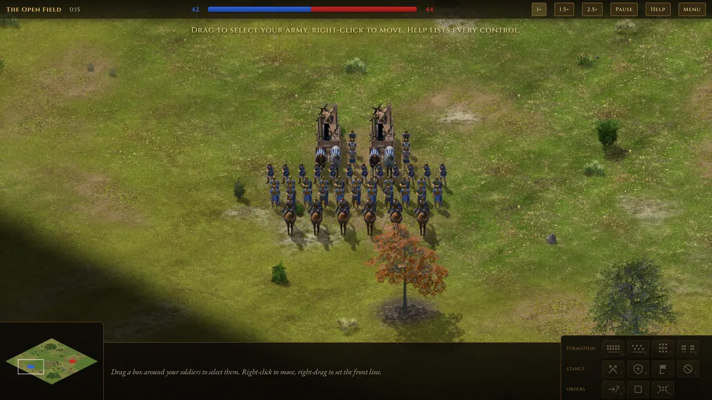
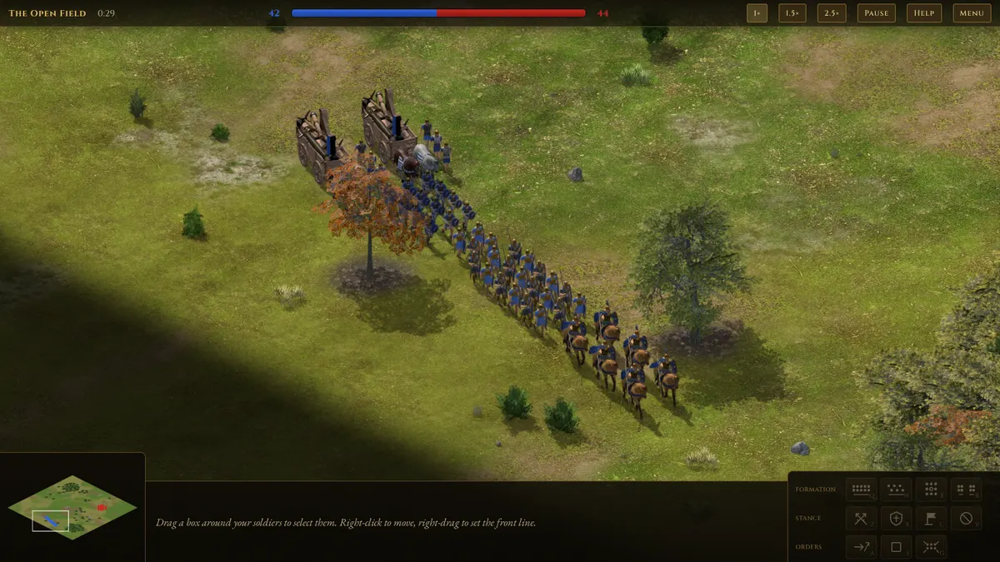

# Formation movement

How units move together in this game: what Age of Empires II does, what other
games and papers add, and how we built it. The code lives in
`src/sim/formationLayout.ts` (slot layouts and assignment) and
`src/sim/formation.ts` (the controller). The tests are
`tests/formationLayout.test.ts` and `tests/formationMove.test.ts`.

World units: distances are in `u`. An infantryman has a radius of 1 u and a
knight 1.9 u, so one AoE2 tile is roughly 4–5 u.

## Contents

1. [Summary](#1-summary)
2. [How Age of Empires II does it](#2-how-age-of-empires-ii-does-it)
3. [What we took from elsewhere](#3-what-we-took-from-elsewhere)
4. [Our implementation](#4-our-implementation)
5. [Parameters](#5-parameters)
6. [Sources](#6-sources)

## 1. Summary

AoE2 sorts a selection into four **sub-formations**, front to back: cavalry,
melee infantry, ranged, siege. Inside a sub-formation the unit types alternate.
Each sub-formation's spacing comes from its widest unit, and the widest
sub-formation widens the rows of the others. The group walks at the slowest
unit's speed, long moves use a hidden narrow **marching column**, and units far
from the group don't join. There are four player-selectable shapes: line,
staggered, box and flank.

We copy that model and fix the problems AoE2 and 0 A.D. are known for:

| Problem in the reference games | What we do instead |
|---|---|
| Greedy slot assignment makes units cross paths (0 A.D.) | Optimal assignment on squared distances per unit type (CAPT). Units keep their left/right and front/back order and their straight paths don't cross. |
| Units turn around to "regroup" before advancing (AoE2 DE complaint) | During a march a member never moves backwards; a unit that is ahead of its slot waits for the slot to reach it. |
| Units arrive one by one when forming up | Synchronized arrival: every member gets a speed so that all of them arrive together. |
| Outer ranks fall behind on corners | The anchor path has rounded corners and the anchor slows down on tight curves. |
| Formations dive into one-unit gaps (0 A.D. paths with the largest unit's clearance) | The anchor's path keeps a 2 u margin beyond the largest unit's radius whenever such a route exists. Slots that land inside trees or water slide back towards the formation centre, and a destination inside a forest is moved to where the layout fits. |
| A displaced catapult never catches up (0 A.D. siege can't run) | All members get a catch-up multiplier (1.4×, siege 1.2×), only while in formation and never in combat. |
| One far unit makes the whole army wait (0 A.D. waits for everyone) | Members beyond the join radius walk on their own; a member that cannot keep up becomes a straggler after 6 s. Arrival counts at 90 % of members. |

## 2. How Age of Empires II does it

Most of what is known comes from openage's reverse-engineering notes, the AoE2
DE patch notes and community wikis; see [Sources](#6-sources). Exact row-count
formulas and slot distances in tiles are not published anywhere we could find.

### Sub-formations

| Order | Sub-formation | AoE2 units | Ours |
|---|---|---|---|
| 1 (front) | Cavalry | knights, light cavalry, ... | knights |
| 2 | Melee infantry | militia line, spearmen, ... | footmen, pikemen |
| 3 | Ranged | archers, skirmishers, cavalry archers | archers |
| 4 (back) | Siege and support | rams, mangonels, monks | catapults |

Villagers and trade carts never join; they walk on their own.

- **Interleaving.** Inside a sub-formation, unit types alternate round-robin in
  the order they appear in the selection. Five archers (A), three skirmishers
  (S) and six longbowmen (L) come out as `LASLASLASL...` until a type runs out.
- **Spacing.** The widest/longest unit of a sub-formation sets the spacing of
  all its rows (one scorpion spreads every archer row). The widest
  sub-formation widens the others: 14 swordsmen alone form 7×2, but with six
  rams they spread into one row to match the ram row.
- **Speed.** The group moves at its slowest unit's speed (introduced with AoK;
  in AoE1 every unit walked at its own speed). Knights with rams crawl.
- **Join radius.** Units more than about 10 tiles from the group don't join
  the formation.
- **Marching column.** A long move uses a narrow column, "a line formation
  turned by 90°", that fits through gaps in tree lines. The threshold was 10
  tiles; DE Update 107882 (March 2024) raised it to 30 tiles.
- **Facing.** The formation faces the last walking direction. AoE2 DE has no
  drag-to-face; AoE IV and Total War do.
- **Collisions.** Units in the same formation don't collide with each other.
- **Combat.** Fighting dissolves the formation into individuals that follow
  their stance (aggressive, defensive, stand ground, no attack). Attack-move
  makes a marching formation fight what it meets; a plain move walks past
  enemies.

### The four shapes

Schematic, front at the top. K knight, F footman, P pikeman, A archer, C catapult.

```
LINE (default)              STAGGERED (spacing doubled)
     K K K K K K                K   K   K   K   K   K
 F P F P F P F P F P F       F   P   F   P   F   P   F
 P F P F P F P F P F F         P   F   P   F   P   F   F
A A A A A A A A A A A A     A   A   A   A   A   A   A   A
       C       C                    C       C

FLANK (two halves, gap)     BOX (strong outside, weak inside)
  K K K          K K K       P  F  K  P  F  P  F
F P F P F P    F P F P F P   K  F  A  A  A  F  K
 F P F P F      P F P F F    F  A           A  P
A A A A A A    A A A A A A   P  A  C     C  A  F
    C              C         F  A           P  K
                             P  A  F  A  A  A  P
                             K  F  P  K  F  P  F
```

- **Staggered**: players use it against mangonels and scorpions, which then hit
  fewer units per shot.
- **Box**: rarely used; the outer units are exposed and siege can fire into
  the middle.
- **Flank**: players switch to it as enemy siege fires, so the shot lands in
  the gap, then switch back.

### Known complaints

- Units turn back to "regroup" before advancing, even when already in a good
  spot; front units move to the back when retreating. DE Update 153015 (August
  2025) partly fixed this and added a Ctrl+right-click "escape" move that skips
  assembling.
- Mixed armies crawl at siege speed.
- Formations break up around small obstacles (mitigated in Update 141935).
- Staggered spacing shrinks with very large groups (player report).

## 3. What we took from elsewhere

### 0 A.D.

0 A.D. is open source, so its formation code can be read directly
(`simulation/components/Formation.js`, `UnitAI.js`, `CCmpUnitMotion.h`).

- An invisible **controller entity** pathfinds as one unit. Its speed is the
  slowest member's walk speed.
- Every turn each member chases `controllerPos + rotate(offset, angle)` at its
  *run* speed (infantry 1.67×, cavalry 1.4×, siege 1.0×), but never moves
  further than the slot. That speed-matches the members automatically.
- Members of one formation can walk through each other.
- Moves longer than 128 m (about 32 tiles) switch to a 3-wide column.
- Turns larger than `MaxTurningAngle` (1 rad) recompute and reassign the slots;
  smaller turns just rotate the formation.
- On contact, the formation dissolves into individuals and re-forms when they
  are all done.

We borrowed the controller-plus-offsets model, the catch-up multiplier, the
3-wide column, re-forming after combat and pass-through inside a formation. We
avoided its greedy assignment (crossing paths), pathing with the largest
member's clearance (squeezing into tiny gaps), siege without catch-up, and
waiting for *all* members before re-forming (one chaser stalls everyone).

### Dave Pottinger (Ensemble Studios, 1999)

"Coordinated Unit Movement" and "Implementing Coordinated Movement",
*Game Developer*, January 1999. Pottinger built AoE2's movement code.

- A group has a commander that pathfinds for everyone, a centroid, and a
  maximum speed at which it can move while staying together.
- A formation is a stricter group with states *broken*, *forming* and
  *formed*: "a formation can't move until it's formed". Forming fills slots
  from the centre outwards.
- Units may overlap slightly: a soft radius for planning, a hard radius for
  unacceptable overlap. Collisions are resolved by priority (who yields, who
  waits, who re-paths).
- If no path exists, the formation may break and re-form on the far side.

We use the commander as our anchor, the "group waits for its units" rule as the
lag throttle, the forming state as synchronized arrival, and soft collisions
inside the formation.

### Other games

- **AoE IV**: units get a temporary catch-up boost to reach their slot, capped
  at +40 % (patch 11009 cut siege to the same cap to stop a "race car" exploit).
  Right-click-drag sets facing. Our catch-up is capped the same way and is off
  in combat.
- **Total War**: right-drag sets the front line, which gives width and facing;
  depth follows from the head count. We copied this control.
- **StarCraft II**: no formations, but a group move keeps each unit's offset
  from the group centre ("magic box"). Squared-distance assignment gives the
  same effect for free (see below).
- **Company of Heroes** (Chris Jurney, *AI Game Programming Wisdom 4*): when
  units die or join, make only the necessary slot swaps, "because it looks
  awkward when a soldier randomly runs from the left side to the right". This
  is our stability bonus on re-layout.

### Papers and books

- **CAPT** (Turpin, Michael and Kumar, *IJRR* 2014): assign robots to goals by
  minimising the sum of *squared* distances, then move everyone in straight
  lines that start and end at the same time. The paths are provably
  collision-free when start and goal points are at least 2√2·R apart.
  Squared-distance cost is also translation invariant: moving every slot by the
  same vector does not change the optimal assignment, so assigning against
  slots 200 u away gives the same answer as assigning against slots around the
  army's current position. Units keep their relative order.
- **Reynolds' steering behaviours** (GDC 1999): offset pursuit plus arrival is
  exactly a formation member's control law.
- **Millington and Funge**, *AI for Games* §3.7: use an invisible anchor
  rather than a leader unit, tie the anchor to its members so it doesn't run
  away, and give slots roles (our typed slots).
- **Bjore**, *Game AI Pro* ch. 21: build turns from steering circles so the
  outer ranks can keep up. We round path corners to at least the formation's
  half-width.

### Our own experiments

Done while designing the system, with 200 random trials per case:

- **Assignment.** A 20-unit mob forming a line: greedy nearest-slot assignment
  (0 A.D. style) produced colliding paths in 100 % of trials and 3.3 crossings
  per order. Squared-distance Hungarian (CAPT) produced collisions in 0 % of
  trials. For a 40-unit line turning 90°, greedy averaged 38.6 crossings and
  CAPT stayed collision-free.
- **Turning.** A rigid 36-unit line taking a sharp 90° corner without a speed
  cap left its outer units 3.9 tiles behind their slots. Rounding the corner to
  a radius of at least the half-width and capping speed by curvature kept the
  error under 0.1 tile and cost 0–6 % extra time.
- **Hungarian cost.** 0.1 ms for 20 units, 0.3 ms for 40 and 0.9 ms for 60
  (Node 22, one solve). That is cheap enough per order, but not per frame.

## 4. Our implementation

### 4.1 Unit classes and spacing

| Unit | Sub-formation | Radius | Spacing side × depth | Speed (u/s) |
|---|---|---|---|---|
| Knight | cavalry | 1.9 | 4.4 × 6.6 | 11 (charge 14) |
| Footman | infantry | 1.0 | 2.7 × 2.9 | 7.5 |
| Pikeman | infantry | 1.0 | 2.6 × 2.9 | 7.2 |
| Archer | ranged | 1.0 | 2.6 × 3.0 | 7.8 |
| Catapult | siege | 3.0 | 12 × 10 | 4.6 |

Footmen and pikemen share the infantry sub-formation and alternate, so pikes are
spread along the whole front, as in AoE2.

### 4.2 Layouts (`formationLayout.ts`)

All layouts work in a local frame: `x` to the right, `y` forward, front row has
the largest `y`. Offsets are re-centred so the anchor is the slot centroid.
Every slot is **typed** with the unit kind that will stand there: slots are
labelled in fill order (front row first, left to right) with the interleaved
kind sequence, so the AoE2 interleave survives any later reassignment.

**Line.** Each sub-formation's natural width uses `cols ≈ sqrt(n·3)`, clamped
to 3–16. A second, whole-army term `cols ≈ sqrt(N·4)` keeps a mixed army wider
than deep. (AoE2's "widest sub-formation widens the rest" rule alone gave a
prototype army 3 tiles wide and 7 deep.) The frontage `W` is the larger of the
two, or the player's dragged width. Each sub-formation then fills rows of
`floor(W / pitch) + 1` units, in balanced rows (sizes differ by at most one,
fuller rows in front), with a 2 u gap between sub-formations. The scenario
army (6 knights, 12 footmen, 10 pikemen, 12 archers, 2 catapults) comes out 29
u wide and 23 u deep, as in the diagram in section 2.

**Staggered.** As line, with lateral spacing ×2 and depth ×1.5; odd rows shift
by half a pitch, so shots and splash fall between units. The same army is 58 u
wide.

**Flank.** Each sub-formation is split into two halves, each laid out as a line
of width `W/2`, centred at `±(gap/2 + W/4)` with a 16 u gap (more than three
times a catapult stone's splash radius).

**Box.** A square grid of `ceil(sqrt(N))` cells per side with one pitch for
everybody, as players report for AoE2. We leave siege out of that pitch,
because a catapult setting it makes the box far too sparse; catapults sit in
the roomy core anyway. Cells are filled ring by ring from the outside in, in
sub-formation order: cavalry and infantry on the outer ring, archers inside,
catapults in the core. Within a ring, kinds are spread by largest deficit so
the knights don't all end up on one side, and empty cells are spread evenly.

**Marching column** (hidden, chosen automatically). Up to three abreast;
wider units get fewer (knights two abreast, catapults in single file).
Sub-formations stay front to back, which puts the knights at the head and siege
at the rear. The scenario army's column is about 8 u wide and 73 u long.





### 4.3 Slot assignment

`assignSlots` groups members by kind and, per kind, solves a Hungarian
assignment (O(k³)) with cost

```
C[i][j] = |pos_i − slotWorld_j|² − (j was i's previous slot ? stability : 0)
```

The stability bonus (4 u²) is used only when re-laying out after a unit dies
or joins, so survivors keep their places and holes close up quietly. Members are
sorted by id first, so the result is deterministic.

### 4.4 Orders and movement modes

A move order (`Formation.orderMove`) does the following:

1. Every member drops its target and follows the formation again.
2. **Join radius.** Members are clustered by single link at 40 u. Members
   outside the largest cluster become *stragglers*: they walk on their own,
   path to their slot and rejoin when they get within 8 u of it.
3. **Facing.** The final heading is the direction of travel, unless the player
   dragged a front line (section 4.8).
4. **Destination.** If many battle-layout slots would fall into obstacles,
   `fitAnchor` searches rings of 4–36 u around the click for an anchor where
   the formation fits.
5. **Path.** The anchor's A* path asks for a clearance of the largest unit's
   radius plus 2 u (at most the layout's half-width), so the formation doesn't
   squeeze through gaps only one unit wide, and falls back to the largest
   radius alone if no such route exists. Paths are string-pulled, corners are
   rounded (`SmoothPath`), and the result is parametrised by arc length.
6. **Mode.** One of three:

| Mode | When | What happens |
|---|---|---|
| `march` | path longer than 100 u and at least 4 members | Column layout. Slots are path-relative: each slot sits at `path(s + slot.y)` offset sideways by `slot.x`, so the column snakes along the path. Near the end, the formation deploys into the battle layout with synchronized arrival. |
| `rigid` | already formed in the same layout and the path starts within 35° of the current facing | The formed block slides along the path, rotating at a rate its outer ranks can follow. Corners are rounded to `clamp(halfWidth, 6, 30)`. |
| `sync` | short moves, turns over 35°, re-forming, deploying | Each member goes straight to its slot at the destination (or paths there if it can't see it). Speeds are set so everyone arrives together (below). |

**Synchronized arrival.** Each member's own travel time is `t_i = d_i / v_i`
(plus pack-up time for a deployed catapult). The common duration is
`T = min(max t_i, 1.5·median t_i + 0.5)`, so one far unit doesn't make everyone
dawdle. Each member walks at `d_i / T`, but never slower than 35 % of its own
speed; units whose own time exceeds `T` simply go at full speed. Thanks to CAPT,
the straight paths don't cross. The formation becomes `idle` when 90 % of the
members stand within 0.8 u of their slots, or `T + 4` seconds have passed.

**End of a rigid move.** If the final facing differs from the walking
direction by up to 50°, the block pivots in place; beyond that it re-forms with
synchronized arrival.

### 4.5 Anchor speed

```
v = 0.9 · min(member speed)                                  headroom so the slowest can close gaps
v = min(v, k_min · v_min · R / (R + halfWidth))              rigid mode: curvature cap on the next 8 u of path
v = v · clamp(1 − (lag − 4) / (14 − 4), 0, 1)                the group waits for its units
```

- `lag` is the largest distance a member is **behind** its slot along the
  local march direction, plus half its sideways error. A member that is
  *ahead* of its slot doesn't count: it is simply waiting for the slot. Counting
  it made a column that started out of order crawl at a fifth of its speed;
  the regression test `keeps marching at full pace when units start ahead of
  their column slots` covers this.
- A catapult packing up counts as maximal lag, so the formation waits for it.
- If the lag stays at the stop threshold for 6 s, the worst laggard becomes a
  straggler and stops holding everyone back.

### 4.6 Member control law

Each tick, for each member under formation control:

```
slotW   = rigid/battle: anchor + R(heading) · slot      march: path-relative slot
slotVel = (slotW − previous slotW) / dt                 feed-forward
v       = slotVel + 1.5 · (slotW − pos)                 offset pursuit with arrival
if moving: drop any component of v that points backwards along the march
|v| ≤ catchUp · ownSpeed                                1.4, siege 1.2
```

If the slot is more than 3 u away and not in line of sight, the member paths
to it instead. Slots that land inside an obstacle are projected back towards
the formation centre in 0.75 u steps (`projectSlot`), so the formation hugs a
forest edge instead of pushing units into the trees.

### 4.7 Combat

| Order | Behaviour |
|---|---|
| Move | Forced march: members ignore enemies, as in AoE2. |
| Attack-move | The formation marches. Each member acquires targets on its own: archers at bow range, catapults at their range, melee units when an enemy is within 16 u (26 u once the formation has stopped). Members peel off while the rest keep marching. Once half the formation is fighting, the anchor stops and the formation becomes `engaged`. A column first deploys in place, so home points make sense. |
| Attack unit | Members walk to the target and fight; the formation is `engaged`. |

While engaged, slots are only **home points**. Stances set the leash:

| Stance | Melee leash | Archer leash | Catapult |
|---|---|---|---|
| Aggressive | 48 u | 18 u | never chases |
| Defensive | 22 u | 8 u | never chases |
| Stand ground | doesn't move | doesn't move | — |
| No attack | doesn't fight | doesn't fight | doesn't fight |

Melee units prefer their counters (pikes look for knights, knights for archers
and siege) and spread out: they avoid piling more than 3 attackers onto an
infantry target, or more than 4 onto a knight or catapult. Archers focus wounded targets and skip units that arrows
already in flight will kill. Catapults pick dense enemy clusters and avoid
targets next to friends.

**Re-forming.** After 2 s with no enemy within any member's acquisition radius
and nobody fighting, the formation re-forms on its survivors with synchronized
arrival. If it was attack-moving and is still more than 8 u from its
destination, it resumes the attack-move instead. An idle formation whose
members were pushed out of place re-forms every 2 s, but only once everyone has
stopped fighting.

When members die, the layout is recomputed half a second later (debounced) with
the stability bonus, so the survivors close ranks without reshuffling.

### 4.8 Player controls

- **Right-click** moves the formation; the facing is the walking direction.
- **Right-drag** draws the front line (Total War style): its length is the
  frontage, the facing is perpendicular to it, pointing away from the army,
  and the front row's centre lands on the line. A ghost preview of every slot
  is shown while dragging.
- **A + click** attack-moves. **S** stops. **G** regroups the selection into one
  formation where it stands.
- **Q W E R** switch between line, staggered, box and flank, re-forming in
  place or continuing the current move in the new shape.
- **Z X C V** set the stance.

### 4.9 Collisions

Separation is a soft push between overlapping neighbours (radius sum + 0.4 u),
weighted by relationship: 0.35 inside the same formation (members may pass
through each other, as in AoE2 and 0 A.D.), 1 between friendly units of
different groups, and 1.4 against enemies. Velocities are acceleration limited
(knights 22 u/s², catapults 10, infantry 30) and integrated against the static
grid with wall sliding.

### 4.10 The AI

The computer opponent uses the same API as the player. It keeps a main battle
line of infantry, archers and siege, and runs its knights as a separate
formation that escorts the line's flank, swings wide to hit exposed archers
and catapults, and pulls back when it finds itself among pikes. On Easy it
fights as one block and reacts slowly; on Hard it reacts twice as fast as
Normal and fields 20 % more troops.

## 5. Parameters

| Parameter | Value | Where |
|---|---|---|
| Join radius | 40 u | `FORMATION.joinRadius` |
| March threshold (path length) | 100 u | `FORMATION.marchDistance` |
| Anchor headroom | 0.9 × slowest speed | `FORMATION.headroom` |
| Member gain | 1.5 /s | `FORMATION.gain` |
| Lag throttle start / stop | 4 u / 14 u | `FORMATION.lagStart`, `lagStop` |
| Straggler timeout | 6 s at the stop threshold | `advanceAnchor` |
| Settled distance / quorum | 0.8 u / 90 % | `FORMATION.settled`, `settledRatio` |
| Calm time before re-form | 2 s | `FORMATION.calmTime` |
| Rigid move max initial turn | 35° | `FORMATION.rigidTurn` |
| Pivot at the end of a move | up to 50° | `FORMATION.pivotTurn` |
| Catch-up multiplier | 1.4, siege 1.2 | `catchUp()` |
| Sync arrival cap | `1.5 · median + 0.5` s | `beginSync` |
| Sub-formation gap | 2 u | `LAYOUT.classGap` |
| Line aspect per sub-formation / whole army | 3 / 4 | `LAYOUT.aspect`, `totalAspect` |
| Columns per row | 3–16 | `LAYOUT.minCols`, `maxCols` |
| Staggered spacing | ×2 sideways, ×1.5 depth | `LAYOUT.staggerSide`, `staggerDepth` |
| Flank gap | 16 u | `LAYOUT.flankGap` |
| Column width | 3 abreast | `LAYOUT.columnWidth` |
| Re-layout stability bonus | 4 u² | `layoutAndAssign` |
| Attack-move engage quorum | 50 % fighting | `checkContact` |

## 6. Sources

**AoE2 internals and history**
- openage reverse-engineering notes: `doc/reverse_engineering/game_mechanics/formations.md`,
  `pathfinding.md`, `damage.md`, `accuracy.md`; `doc/nyan/api_reference/reference_util.md`
  (sub-formation `ordering_priority`, stances). https://github.com/SFTtech/openage
- D. Pottinger, "Coordinated Unit Movement", *Game Developer*, 1999-01-22.
  https://www.gamedeveloper.com/programming/coordinated-unit-movement
- D. Pottinger, "Implementing Coordinated Movement", *Game Developer*, 1999-01-29.
  https://www.gamedeveloper.com/programming/implementing-coordinated-movement
- M. Pritchard, "Postmortem: Ensemble Studio's Age of Empires II: Age of Kings".
  https://www.gamedeveloper.com/design/postmortem-ensemble-studio-s-age-of-empires-ii-age-of-kings
- Age of Empires wiki: "Unit formation", "Battle Formations", "Unit stance".
  https://ageofempires.fandom.com/wiki/Unit_formation
- HeavenGames AoK University, "Formations".
  https://aok.heavengames.com/university/game-info/general-info/formations/
- AoE2 DE patch notes: Update 107882 (column threshold 10 → 30 tiles),
  Update 141935, Update 153015 (escape move, regroup fixes).
  https://www.ageofempires.com/news/age-of-empires-ii-definitive-edition-update-107882/
  https://www.ageofempires.com/news/age-of-empires-ii-definitive-edition-update-153015/
- AoE2 forum, "Feedback on Unit Pathing and Formations in AoE2: DE".
  https://forums.ageofempires.com/t/feedback-on-unit-pathing-and-formations-in-aoe2-de/271768

**0 A.D.** (read in source, commit 61a3b950, 2024-08-17)
- `binaries/data/mods/public/simulation/components/Formation.js`, `UnitAI.js`,
  `FormationAttack.js`; `templates/template_formation.xml`,
  `templates/special/formations/*.xml`;
  `source/simulation2/components/CCmpUnitMotion.h`, `CCmpUnitMotion_System.cpp`;
  `simulation/helpers/Commands.js`. https://github.com/0ad/0ad

**Other games**
- AoE IV hotkeys (right-drag facing move), Xbox Wire, 2021.
  https://news.xbox.com/en-us/2021/10/22/age-of-empires-iv-hotkeys-revealed/
- AoE IV patch 11009 (catch-up cap). https://ageofempires.com/news/age-of-empires-iv-patch-11009
- Liquipedia, StarCraft II "Definitions" (magic box). https://liquipedia.net/starcraft2/Definitions
- C. Jurney, "Company of Heroes Squad Formations Explained", *AI Game Programming Wisdom 4*, 2008.

**Techniques**
- M. Turpin, N. Michael, V. Kumar, "CAPT: Concurrent assignment and planning of
  trajectories for multiple robots", *IJRR* 33(1), 2014.
- C. Reynolds, "Steering Behaviors For Autonomous Characters", GDC 1999.
  https://www.red3d.com/cwr/steer/gdc99/
- I. Millington, J. Funge, *Artificial Intelligence for Games*, 2nd ed., §3.7.
- S. Bjore, "Techniques for Formation Movement Using Steering Circles",
  *Game AI Pro*, ch. 21.
  http://www.gameaipro.com/GameAIPro/GameAIPro_Chapter21_Techniques_for_Formation_Movement_Using_Steering_Circles.pdf
- E. Emerson, "Crowd Pathfinding and Steering Using Flow Field Tiles",
  *Game AI Pro*, ch. 23.
- J. van den Berg et al., "Reciprocal n-body Collision Avoidance" (ORCA), 2011.
  https://gamma.cs.unc.edu/ORCA/
